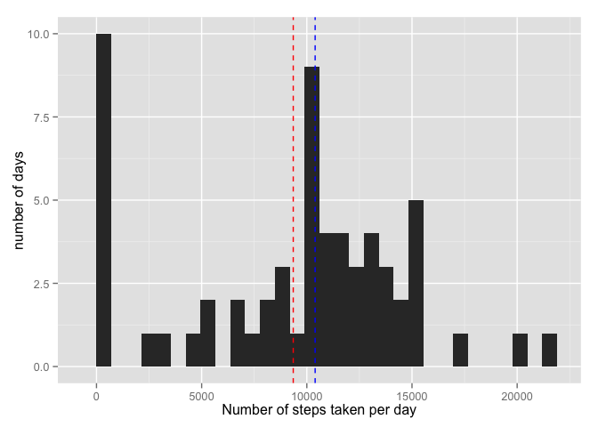
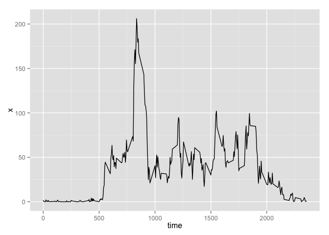
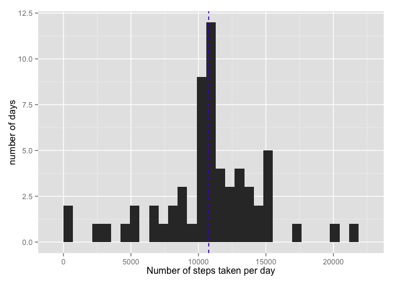
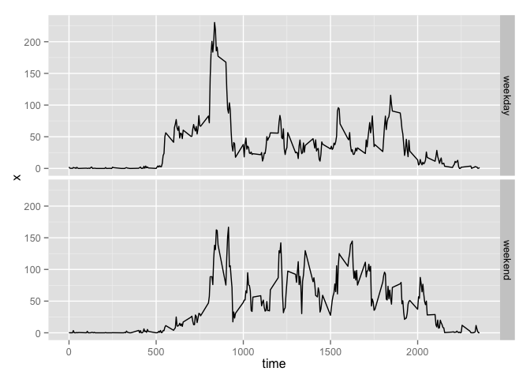

# Reproducible Research project 1
Ahmad Bisher Tarakji  
June 14, 2015  

##Introduction
This assignment makes use of data from a personal activity monitoring device. This device collects data at 5 minute intervals through out the day. The data consists of two months of data from an anonymous individual collected during the months of October and November, 2012 and include the number of steps taken in 5 minute intervals each day.

##Assignment 1
Compute the total number of steps taken each day and plot a histogram of the total number of steps per day. Also compute the mean and median for this variable.


```r
require(knitr)
```

```
## Loading required package: knitr
```

```r
opts_chunk$set(echo = TRUE, cache = FALSE, cache.path = "cache/", fig.path = "figure/")
data<-read.csv("activity.csv")
#aggregate the data by date using the sum function to
#calculate total number of steps taken each day
agg1<-aggregate(data$steps,list(Date=data$date),sum,na.rm=T)
mx1<-mean(agg1$x)
mx2<-median(agg1$x)
print(mx1)
```

```
## [1] 9354.23
```

```r
print(mx2)
```

```
## [1] 10395
```

```r
require("ggplot2")
```

```
## Loading required package: ggplot2
```

```r
#using ggplot draw a histogram of total number of steps taken each day
#red line is mean blue line is median
qplot(agg1$x,xlab="Number of steps taken per day",ylab="number of days")+geom_vline(xintercept = mx1,color="red",linetype="dashed")+geom_vline(xintercept = mx2,color="blue",linetype="dashed")
```

 

##Assignment 2
Make a time series plot of the 5-minute interval (x-axis) and the average number of steps taken, averaged across all days (y-axis).


```r
agg2<-aggregate(data$steps,by=list(time=data$interval),FUN=mean,na.rm=T)
ggplot(data=agg2,aes(x=time,y=x))+geom_line()
```

 

Which 5-minute interval, on average across all the days in the dataset, contains the maximum number of steps?

```r
agg2[which(agg2$x==max(agg2$x)),c("time")]
```

```
## [1] 835
```
So it seems that the interval 835 would contain the highest average of steps across all monitored days.

##Assignment 3
1.Calculate and report the total number of missing values in the dataset 

```r
nrow(data[which(is.na(data$step)),])
```

```
## [1] 2304
```

2.Devise a strategy for filling in all of the missing values in the dataset.  
By using the average number of steps computed for each interval across all days we can subsitute each NA value with its corresponding value.


```r
#create a list of values that contains the mean steps for this interval if the original value is na
data3<-apply(data[,c("steps","interval")],MARGIN = 1,function(x){ifelse(is.na(x[1]),agg2[which(agg2$time==x[2]),2],x[1])})
```

3.Create a new dataset that is equal to the original dataset but with the missing data filled in.

```r
#bind it to a new data.frame 
newData<-data[,c("date","interval")]
newData$steps<-data3
```

Make a histogram of the total number of steps taken each day and Calculate and report the mean and median total number of steps taken per day. 

```r
agg3<-aggregate(newData$steps,list(Date=newData$date),sum)
mx3<-mean(agg3$x)
mx4<-median(agg3$x)
print(mx3)
```

```
## [1] 10766.19
```

```r
print(mx4)
```

```
## [1] 10766.19
```

```r
#using ggplot draw a histogram of total number of steps taken each day
#red line is mean blue line is median
qplot(agg3$x,xlab="Number of steps taken per day",ylab="number of days")+geom_vline(xintercept = mx3,color="red",linetype="dashed")+geom_vline(xintercept = mx4,color="blue",linetype="dashed")
```

 

So it seems yes imputing the NA values did change the estimates for the total number of steps taken each day. Both the mean and median are larger and are equal (due to the fact we subsituted the NA with the mean value for each interval)

##Asignment 4

```r
newData$date<-as.Date(as.character(newData$date))
newData$weekday<-weekdays(newData$date)
newData[which(newData$weekday=="Sunday" | newData$weekday=="Saturday"),4]<-"weekend"
newData[which(newData$weekday!="weekend"),4]<-"weekday"
agg4<-aggregate(newData$steps,by=list(time=newData$interval,day=newData$weekday),FUN=mean,na.rm=T)
ggplot(data=agg4,aes(x=time,y=x))+geom_line()+facet_grid(day~.)
```

 

Yes it seems there is a different in activity on weekends (slower mornings obviously)
